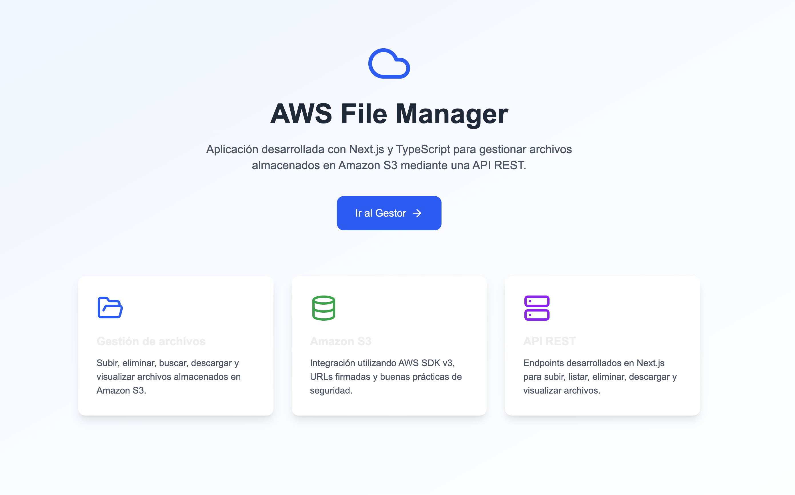
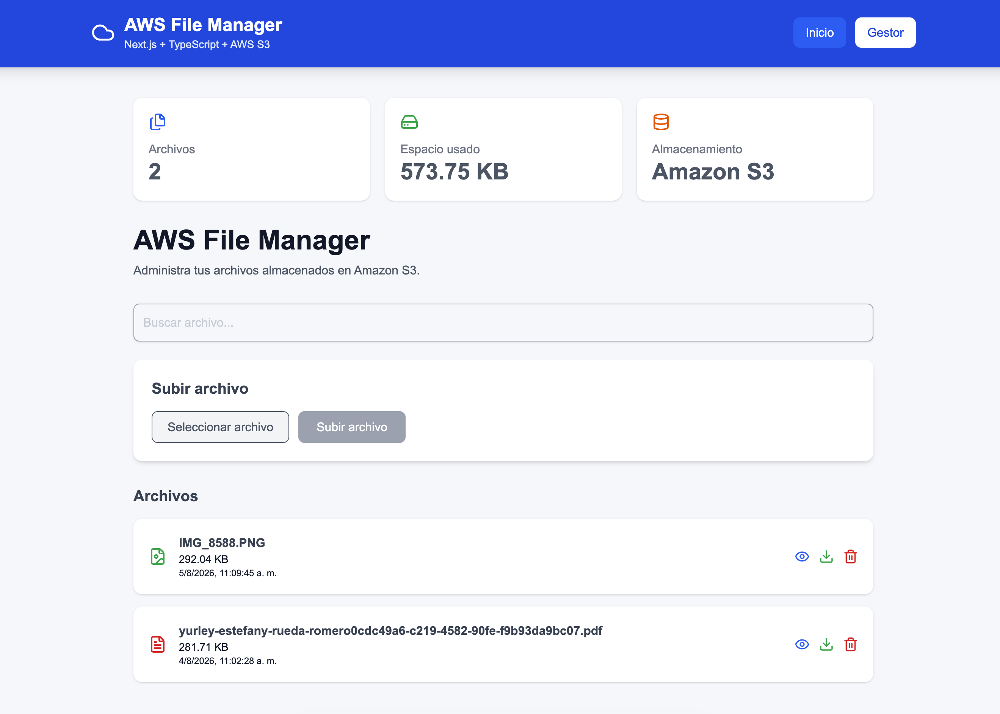
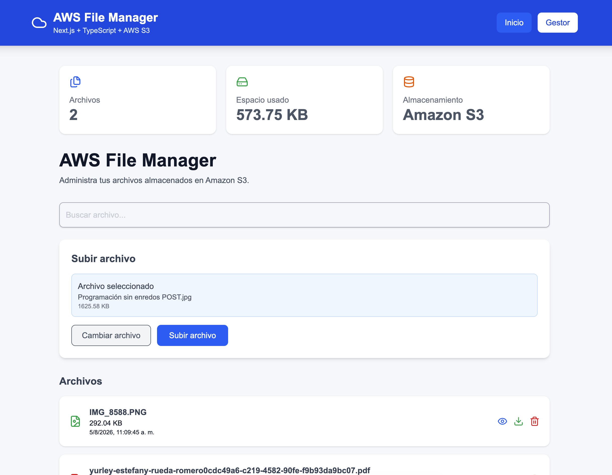
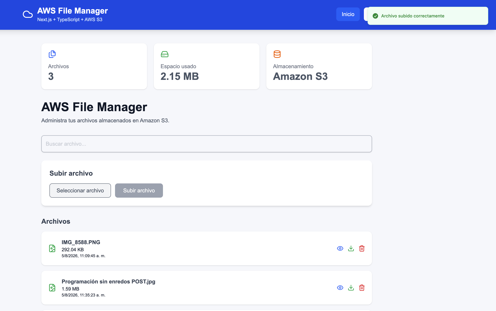
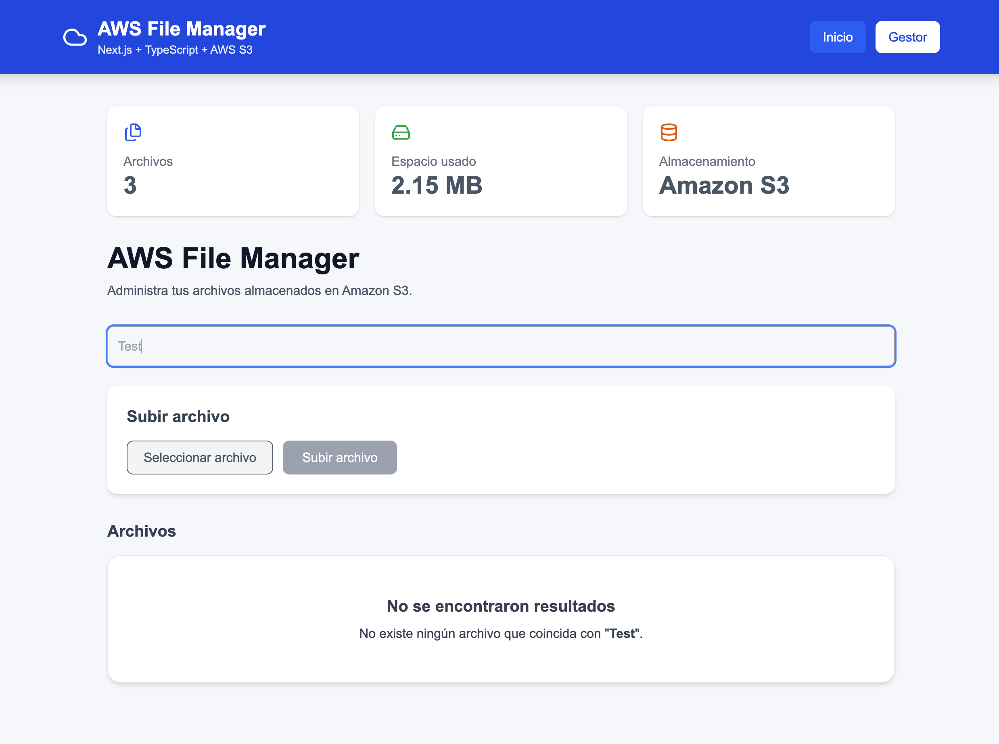
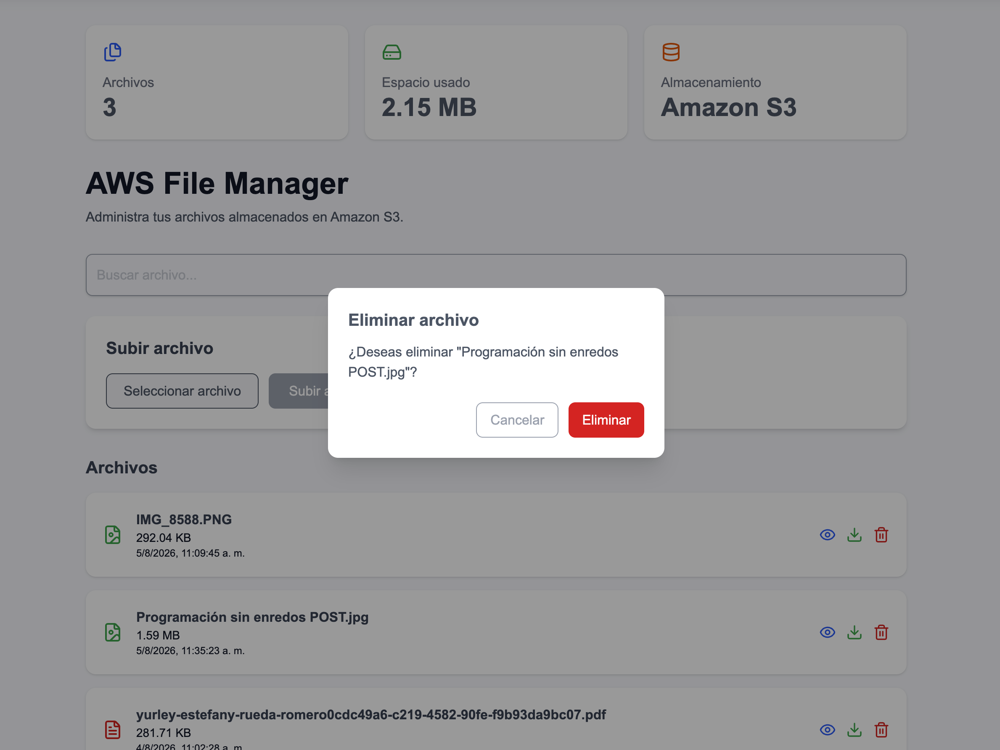

# ☁️ AWS File Manager

Aplicación web desarrollada con **Next.js**, **TypeScript** y **Amazon S3** para gestionar archivos mediante una API REST.

Permite subir, listar, buscar, descargar, visualizar y eliminar archivos almacenados en un bucket de Amazon S3.

## 🚀 Demo

**Aplicación desplegada en AWS Amplify:**

> https://main.d3t5wu73qk0n87.amplifyapp.com

---

## 📸 Capturas

Agrega aquí algunas imágenes del proyecto.

### Página principal



### Gestor de archivos



### Cargue de archivos



### Confirmaciones



### Búsqueda de archivos



### Eliminación de archivos



### Vista previa de archivos


---

## ✨ Funcionalidades

- 📤 Subida de archivos a Amazon S3
- 📁 Listado de archivos
- 🔍 Búsqueda por nombre
- 👁️ Vista previa de imágenes
- ⬇️ Descarga de archivos
- 🗑️ Eliminación con confirmación
- 🔔 Notificaciones mediante Sonner
- 📱 Diseño responsive
- ⚡ API REST con Next.js

---

## 🛠️ Tecnologías

- Next.js
- React
- TypeScript
- Tailwind CSS
- Amazon S3
- AWS SDK v3
- AWS IAM
- AWS Amplify
- Sonner
- Lucide React

---

## 📂 Estructura del proyecto

```text
app/
│
├── api/
│   └── files/
│       ├── route.ts
│       ├── download/
│       └── preview/
│
├── upload/
│   └── page.tsx
│
components/
│
├── ConfirmDialog.tsx
├── FileActions.tsx
├── FileCard.tsx
├── FileIcon.tsx
├── ImagePreviewModal.tsx
├── LoadingSpinner.tsx
├── Navbar.tsx
├── SearchBar.tsx
├── StatsCards.tsx
└── UploadForm.tsx
│
hooks/
│
└── useFiles.ts
│
services/
│
└── fileService.ts
│
lib/
│
├── s3.ts
└── utils.ts
│
types/
│
└── file.ts
```

---

## ⚙️ Variables de entorno

Crear un archivo llamado:

```text
.env.local
```

Con las siguientes variables:

```env
AWS_ACCESS_KEY_ID=xxxxxxxx
AWS_SECRET_ACCESS_KEY=xxxxxxxx
AWS_REGION=us-east-1
AWS_BUCKET_NAME=nombre-del-bucket
```

---

## ▶️ Instalación

Clonar el repositorio:

```bash
git clone https://github.com/TU_USUARIO/app_aws_.git
```

Instalar dependencias:

```bash
npm install
```

Ejecutar en modo desarrollo:

```bash
npm run dev
```

Abrir en el navegador:

```
http://localhost:3000
```

---

## 🌐 Endpoints de la API

| Método | Endpoint | Descripción |
|---------|----------|-------------|
| GET | `/api/files` | Obtener archivos |
| POST | `/api/files` | Subir archivo |
| DELETE | `/api/files` | Eliminar archivo |
| GET | `/api/files/download` | Descargar archivo |
| GET | `/api/files/preview` | Vista previa |

---

## ☁️ Despliegue

La aplicación está desplegada utilizando **AWS Amplify**.

Cada vez que se realiza un `git push` a la rama principal, Amplify ejecuta automáticamente el proceso de compilación y despliegue.

---

## 📚 Conocimientos aplicados

Este proyecto demuestra conocimientos en:

- Desarrollo con Next.js y React
- TypeScript
- Consumo y creación de APIs REST
- Integración con Amazon S3
- AWS SDK v3
- AWS IAM
- AWS Amplify
- Componentización
- Hooks personalizados
- Manejo de estado
- Tailwind CSS
- Arquitectura modular

---

## 🔮 Mejoras futuras

- Docker
- Autenticación con Amazon Cognito
- Gestión de carpetas
- Compartir archivos mediante enlaces temporales
- Paginación
- Drag & Drop para subir archivos

---

## 👩‍💻 Autora

**Estefany Rueda**

Proyecto desarrollado como práctica para demostrar habilidades en desarrollo Full Stack con **Next.js**, **TypeScript** y **AWS**.